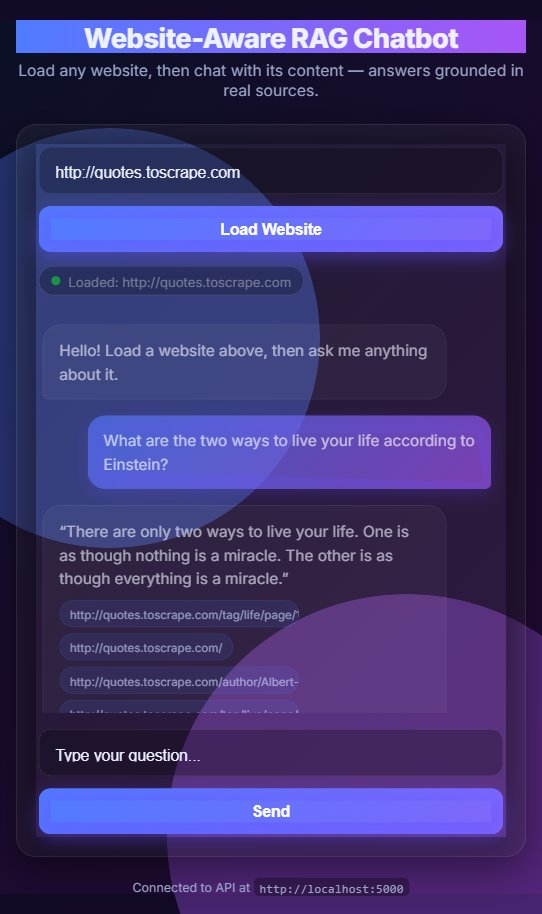
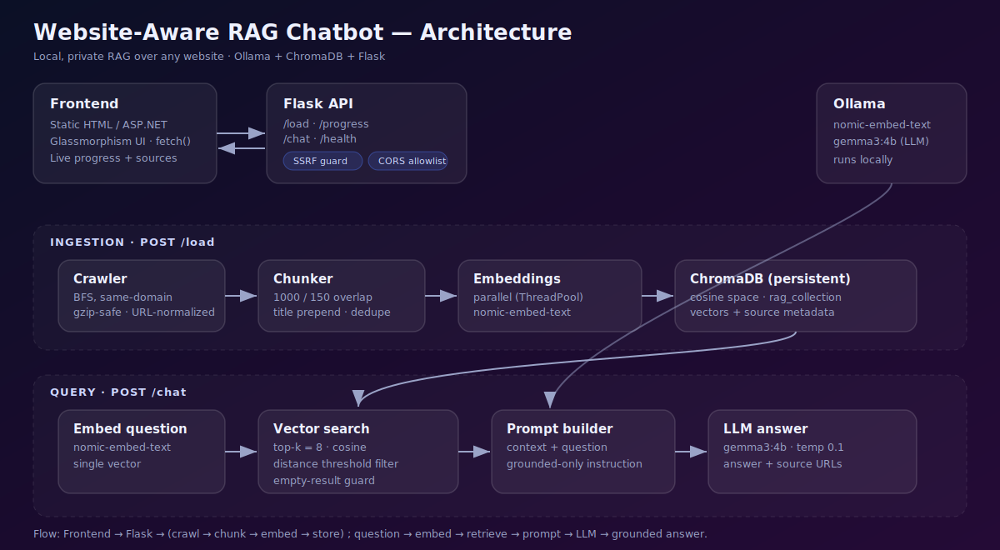

<div align="center">

# 🧠 Website-Aware RAG Chatbot

**Crawl any website, then chat with its content — answers grounded in real sources, running 100% locally.**

[](https://www.python.org/)
[](https://flask.palletsprojects.com/)
[](https://ollama.com/)
[](https://www.trychroma.com/)
[](tests/)
[](LICENSE)



</div>

---

## ✨ Overview

This is a **Retrieval-Augmented Generation (RAG)** chatbot that turns *any* website into a question-answering assistant. Paste a URL, and the backend crawls the site, builds a semantic index, and answers your questions using only that site's content — with **source attribution** and a **hallucination guard** that refuses to answer when the information isn't there.

Everything runs **locally** via [Ollama](https://ollama.com/) — no API keys, no data leaving your machine.

| | |
|---|---|
| 🔎 **Grounded answers** | Responses cite the exact source URLs they came from |
| 🛡️ **Won't hallucinate** | Says "I don't have enough information" when the answer isn't on the site |
| 🔒 **Private by design** | Local LLM + embeddings; SSRF-guarded crawler; CORS-restricted API |
| ⚡ **Live ingestion** | Enter a URL in the UI and watch crawl → embed → ready in real time |
| 🎨 **Polished UI** | Glassmorphism frontend that runs with zero build tooling |

---

## 🏗️ Architecture

<div align="center">

</div>

| Component     | Technology                          |
|---------------|-------------------------------------|
| LLM           | Gemma3:4b via Ollama                |
| Embeddings    | nomic-embed-text via Ollama         |
| Vector Store  | ChromaDB                            |
| Web Crawler   | BeautifulSoup + requests + tldextract |
| API           | Flask + flask-cors                  |
| Prod Server   | Waitress (WSGI)                     |
| Config        | python-dotenv (`.env`)              |
| Frontend      | ASP.NET WebForms (ASPX)             |

---

## 🧰 Tech Stack

```
rag_chatbot/
│
├── app/
│   ├── crawler.py        # Crawls website, saves text files
│   ├── rag_pipeline.py   # Chunks text, builds embeddings, stores in ChromaDB
│   ├── chat.py           # Handles question → search → answer generation
│   └── api.py            # Flask REST API (/load, /progress, /chat, /health)
│
├── data/                 # Crawled text files saved here (generated)
├── chroma_db/            # ChromaDB vector store
├── logs/                 # app.log, visited URLs, and error logs
│
├── config.py             # All settings, loaded from .env with defaults
├── .env.example          # Sample environment configuration
├── requirements.txt      # Python dependencies
└── venv/                 # Virtual environment
```

---

## 📸 Screenshots

- **Dynamic URL Loading** — Enter any URL in the frontend; the backend crawls + embeds it on the fly with live progress (no manual re-crawl)
- **Web Crawler** — Crawls internal pages of any website, skips PDFs/images, MD5-hashed filenames to prevent collisions
- **Smart Chunking** — Splits pages into 1000-char chunks (150 overlap), with page title/URL prepended for context
- **Semantic Search** — Retrieves top-k relevant chunks with a distance threshold to filter out low-relevance matches
- **Hallucination Guard** — Says "I don't have enough information" if answer not found in website
- **Source Attribution** — Shows which URL the answer came from
- **Fast Responses** — Model warmup at startup, parallelized embeddings, optimized chunk retrieval
- **Security Hardening** — SSRF protection (blocks private/internal IPs) and CORS restricted to the frontend origin
- **Configurable** — All settings via `.env` (python-dotenv); structured `logging` to console + rotating file
- **Production-Ready** — Optional Waitress WSGI server (Windows-friendly)
- **REST API** — Clean `/load`, `/progress`, `/chat`, and `/health` endpoints

---

## 🚀 Quick Start

### Prerequisites
- Python 3.10+
- [Ollama](https://ollama.com/) installed and running

### 1. Pull the models
```bash
ollama pull gemma3:4b
ollama pull nomic-embed-text
```

### 2. Install dependencies
```bash
python -m venv venv
# Windows:
venv\Scripts\activate
# macOS/Linux:
source venv/bin/activate

pip install -r requirements.txt
```

### Configure via `.env`
Copy the sample and adjust as needed (real environment variables override these):
```bash
cp .env.example .env
```
Key settings:
```ini
MAX_PAGES=50
LLM_MODEL=gemma3:4b
EMBED_MODEL=nomic-embed-text
FRONTEND_ORIGIN=http://localhost:44300   # ASPX site origin (for CORS)
USE_WAITRESS=false                       # true = production WSGI server
LOG_LEVEL=INFO
```
> All values have sensible defaults in `config.py`, so a `.env` is optional for local use. Be sure `FRONTEND_ORIGIN` matches the origin your ASPX site is served from, or CORS will block the browser.

### Start the API
```bash
# Dev server (Flask)
python -m app.api

# Production server (Waitress) — set USE_WAITRESS=true in .env, then:
python -m app.api
```
> Set `FRONTEND_ORIGIN=http://localhost:8090` in `.env` so CORS allows the page.
> Point the UI at a non-default API with `?api=http://host:port`.

### Load a Website
There's no manual crawl step — start the API, open the frontend, paste a URL, and click **Load Website**. The backend crawls + embeds it and streams progress back to the UI. Then ask your questions.

> The standalone `python -m app.crawler` / `python -m app.rag_pipeline` entry points still exist for offline/debug runs.

### Run the Frontend
Open the ASP.NET project in Visual Studio and press **F5**. The API endpoint is set via the `API_URL` constant at the top of the script in `Default.aspx`.

> **Two frontends ship with this repo:**
> - **`frontend/index.html`** (recommended) — self-contained, zero build. Open it directly or serve it as shown above. Override the API target with `?api=http://host:port`.
> - **`RAGChatbot/Default.aspx`** — an **ASP.NET WebForms snippet**, *not* a standalone Visual Studio project. It's just the `<asp:Content>` fragment; to run it you must paste it into an existing WebForms project (it needs the surrounding `.csproj`, `web.config`, codebehind, and master page). Most users should use `frontend/index.html` instead. If you do use the ASPX page, edit its hardcoded `const API_URL = "http://localhost:5000"` to match your API, and set `FRONTEND_ORIGIN` in `.env` to the IIS Express origin your site is served from, or the browser will block the call via CORS.

---

## 🔌 API Reference

| Method | Endpoint   | Description                                  |
|--------|------------|----------------------------------------------|
| GET    | /          | API status                                   |
| GET    | /health    | Health check + model info                    |
| POST   | /load      | Crawl + embed a website (`{"url": "..."}`); SSRF-guarded |
| GET    | /progress  | Current pipeline status/percent for the UI   |
| POST   | /chat      | Ask a question                               |

| Method | Endpoint | Description |
|--------|----------|-------------|
| `GET`  | `/` | Service status |
| `GET`  | `/health` | Health check + active model names |
| `POST` | `/load` | Crawl + embed a website (SSRF-guarded, one job at a time) |
| `GET`  | `/progress` | Live pipeline status & percentage (for the UI) |
| `POST` | `/chat` | Ask a question about the loaded site |

**Load a site**
```bash
curl -X POST http://localhost:5000/load \
  -H "Content-Type: application/json" \
  -d '{"url": "https://quotes.toscrape.com"}'
```

**Ask a question**
```bash
curl -X POST http://localhost:5000/chat \
  -H "Content-Type: application/json" \
  -d '{"question": "What are the two ways to live your life according to Einstein?"}'
```
```json
{
  "answer": "“There are only two ways to live your life. One is as though nothing is a miracle. The other is as though everything is a miracle.”",
  "sources": ["http://quotes.toscrape.com/tag/life/page/1", "http://quotes.toscrape.com/"]
}
```

---

## 🧪 Testing

```bash
pytest -q
```
A focused suite (25 tests) covers URL normalization, same-domain matching, the SSRF guard, and chunk deduplication — the pure logic that protects correctness and security:

```
25 passed in 1.6s
```

End-to-end behavior was verified manually against `quotes.toscrape.com`: load → crawl → embed → chat all succeed, answers are grounded with correct sources, and out-of-scope questions are correctly refused.

---

## 🔐 Security Considerations

- **SSRF protection** — `/load` resolves the target host and rejects loopback, link-local (`169.254.x` incl. cloud metadata), and RFC-1918 private ranges, plus non-HTTP schemes. ([`app/security.py`](app/security.py))
- **CORS allowlist** — the API only accepts browser requests from the configured `FRONTEND_ORIGIN`, not `*`.
- **Local-only inference** — prompts and crawled content never leave the machine.
- **Concurrency guard** — only one crawl/embed pipeline runs at a time.

---

## 🛠️ Engineering Notes & Design Decisions

A few decisions worth calling out (several were found and fixed through end-to-end testing):

- GPU acceleration for even faster responses
- Response time display in the UI
- IIS deployment for production
- Support for IOCL Barauni and other industrial websites

---

## 📁 Project Structure

```
rag_chatbot/
├── app/
│   ├── crawler.py        # BFS crawler: fetch, clean, normalize, save
│   ├── rag_pipeline.py   # chunk + dedupe + embed + ChromaDB + search
│   ├── chat.py           # retrieve → prompt → LLM answer + sources
│   ├── security.py       # SSRF guard (importable, tested)
│   └── api.py            # Flask API: /load /progress /chat /health
├── frontend/
│   └── index.html        # self-contained glassmorphism UI (no build step)
├── RAGChatbot/
│   └── Default.aspx      # ASP.NET WebForms snippet (paste into an existing WebForms project; not standalone)
├── tests/                # pytest suite (URL, SSRF, dedup)
├── docs/images/          # architecture diagram + screenshots
├── config.py             # all settings, loaded from .env with defaults
├── .env.example          # sample configuration
└── requirements.txt
```

---

## 🗺️ Roadmap

- [ ] Cross-encoder re-ranking for higher retrieval precision
- [ ] Streaming token responses in the UI
- [ ] Multi-site / persistent collections (switch between indexed sites)
- [ ] Dockerfile + compose for one-command setup
- [ ] CI workflow running the test suite on every push

---

## 📄 License

[MIT](LICENSE) © 2026 Shreya

<div align="center">
<sub>Built with Ollama · ChromaDB · Flask — runs entirely on your machine.</sub>
</div>
