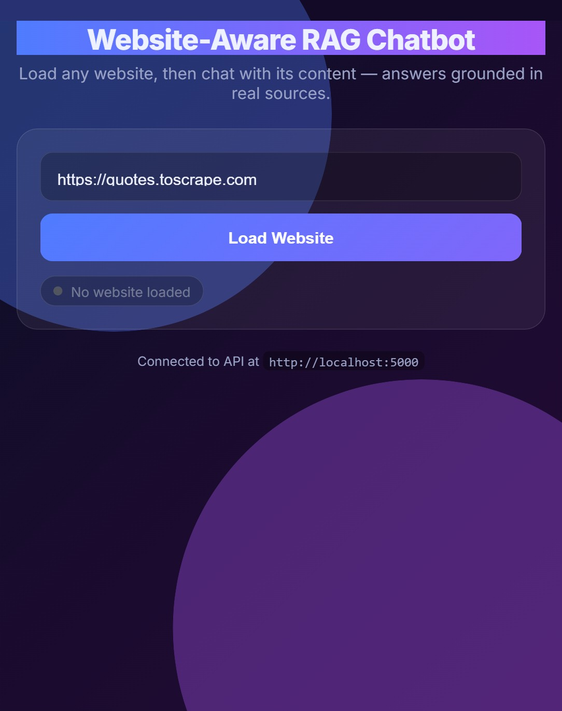

<div align="center">

# 🧠 Website-Aware RAG Chatbot

**Crawl any website, then chat with its content — answers grounded in real sources, running 100% locally.**

[](https://www.python.org/)
[](https://flask.palletsprojects.com/)
[](https://ollama.com/)
[](https://www.trychroma.com/)
[](tests/)
[](LICENSE)


</div>

---

## ✨ Overview

This is a **Retrieval-Augmented Generation (RAG)** chatbot that turns *any* website into a question-answering assistant. Paste a URL, and the backend crawls the site, builds a semantic index, and answers your questions using only that site's content — with **source attribution** and a **hallucination guard** that refuses to answer when the information isn't there.

Everything runs **locally** via [Ollama](https://ollama.com/) — no API keys, no data leaving your machine.

| | |
|---|---|
| 🔎 **Grounded answers** | Responses cite the exact source URLs they came from |
| 🛡️ **Won't hallucinate** | Says "I don't have enough information" when the answer isn't on the site |
| 🔒 **Private by design** | Local LLM + embeddings; SSRF-guarded crawler; CORS-restricted API |
| ⚡ **Live ingestion** | Enter a URL in the UI and watch crawl → embed → ready in real time |
| 🎨 **Polished UI** | Glassmorphism frontend that runs with zero build tooling |

---

## 🏗️ Architecture

<div align="center">

</div>

The system has two clear paths:

- **Ingestion (`POST /load`)** — a BFS crawler fetches same-domain pages → text is cleaned and chunked (with page title/URL prepended for context) → duplicate chunks are dropped → chunks are embedded in parallel → stored in a persistent ChromaDB collection using **cosine** distance.
- **Query (`POST /chat`)** — the question is embedded → ChromaDB returns the top-k nearest chunks (filtered by a distance threshold) → a grounded prompt is built → the local LLM produces an answer plus source URLs.

---

## 🧰 Tech Stack

| Layer | Technology |
|-------|------------|
| LLM | `gemma3:4b` via Ollama |
| Embeddings | `nomic-embed-text` via Ollama |
| Vector store | ChromaDB (persistent, cosine space) |
| Crawler | requests + BeautifulSoup + lxml + tldextract |
| API | Flask + flask-cors |
| Prod server | Waitress (Windows-friendly WSGI) |
| Config | python-dotenv (`.env`) |
| Frontend | Static HTML/CSS/JS (+ ASP.NET WebForms variant) |
| Tests | pytest |

---

## 📸 Screenshots

| Landing | In conversation |
|---------|-----------------|
|  |  |

---

## 🚀 Quick Start

### Prerequisites
- Python 3.10+
- [Ollama](https://ollama.com/) installed and running

### 1. Pull the models
```bash
ollama pull gemma3:4b
ollama pull nomic-embed-text
```

### 2. Install dependencies
```bash
python -m venv venv
# Windows:
venv\Scripts\activate
# macOS/Linux:
source venv/bin/activate

pip install -r requirements.txt
```

### 3. (Optional) Configure
```bash
cp .env.example .env      # tweak models, page limits, CORS origin, etc.
```
All settings have sensible defaults, so a `.env` is optional for local use.

### 4. Start the API
```bash
python -m app.api                 # Flask dev server on :5000
# or set USE_WAITRESS=true in .env for the production server
```

### 5. Open the frontend
```bash
python -m http.server 8090 --directory frontend
# then visit http://localhost:8090
```
> Set `FRONTEND_ORIGIN=http://localhost:8090` in `.env` so CORS allows the page.
> Point the UI at a non-default API with `?api=http://host:port`.

Paste a URL → **Load Website** → ask away. 🎉

---

## 🔌 API Reference

Base URL: `http://localhost:5000`

| Method | Endpoint | Description |
|--------|----------|-------------|
| `GET`  | `/` | Service status |
| `GET`  | `/health` | Health check + active model names |
| `POST` | `/load` | Crawl + embed a website (SSRF-guarded, one job at a time) |
| `GET`  | `/progress` | Live pipeline status & percentage (for the UI) |
| `POST` | `/chat` | Ask a question about the loaded site |

**Load a site**
```bash
curl -X POST http://localhost:5000/load \
  -H "Content-Type: application/json" \
  -d '{"url": "https://quotes.toscrape.com"}'
```

**Ask a question**
```bash
curl -X POST http://localhost:5000/chat \
  -H "Content-Type: application/json" \
  -d '{"question": "What are the two ways to live your life according to Einstein?"}'
```
```json
{
  "answer": "“There are only two ways to live your life. One is as though nothing is a miracle. The other is as though everything is a miracle.”",
  "sources": ["http://quotes.toscrape.com/tag/life/page/1", "http://quotes.toscrape.com/"]
}
```

---

## 🧪 Testing

```bash
pytest -q
```
A focused suite (25 tests) covers URL normalization, same-domain matching, the SSRF guard, and chunk deduplication — the pure logic that protects correctness and security:

```
25 passed in 1.6s
```

End-to-end behavior was verified manually against `quotes.toscrape.com`: load → crawl → embed → chat all succeed, answers are grounded with correct sources, and out-of-scope questions are correctly refused.

---

## 🔐 Security Considerations

- **SSRF protection** — `/load` resolves the target host and rejects loopback, link-local (`169.254.x` incl. cloud metadata), and RFC-1918 private ranges, plus non-HTTP schemes. ([`app/security.py`](app/security.py))
- **CORS allowlist** — the API only accepts browser requests from the configured `FRONTEND_ORIGIN`, not `*`.
- **Local-only inference** — prompts and crawled content never leave the machine.
- **Concurrency guard** — only one crawl/embed pipeline runs at a time.

---

## 🛠️ Engineering Notes & Design Decisions

A few decisions worth calling out (several were found and fixed through end-to-end testing):

- **Cosine, not L2.** ChromaDB defaults to L2 distance, and `nomic-embed-text` vectors are unnormalized — L2 distances landed in the *hundreds*, making any relevance threshold meaningless. The collection is created with `hnsw:space = cosine` so distances are bounded to `[0, 2]` and the threshold actually filters noise.
- **Brotli-safe crawling.** `requests` can't decode `br` responses without an extra package; advertising it silently produced garbage text. The crawler only advertises encodings it can decode.
- **Title-aware chunks.** Each chunk is prefixed with its page title and source URL, extracted *before* boilerplate stripping removes `<head>`.
- **Dedup before embedding.** Repeated quotes/paragraphs across paginated pages are collapsed, which cuts embedding cost and stops near-duplicates from crowding the top-k.
- **`k = 8`.** Author/bio pages are often semantically closer to a query than the page that holds the actual answer; a slightly larger `k` recovers recall while staying within the local model's context window.
- **Lazy loading.** The vector store is loaded on demand so the API starts cleanly even before any site has been indexed.

All retrieval knobs (`RETRIEVAL_K`, `MAX_DISTANCE`, chunk size/overlap, page limit) are configurable via `.env`.

---

## 📁 Project Structure

```
rag_chatbot/
├── app/
│   ├── crawler.py        # BFS crawler: fetch, clean, normalize, save
│   ├── rag_pipeline.py   # chunk + dedupe + embed + ChromaDB + search
│   ├── chat.py           # retrieve → prompt → LLM answer + sources
│   ├── security.py       # SSRF guard (importable, tested)
│   └── api.py            # Flask API: /load /progress /chat /health
├── frontend/
│   └── index.html        # self-contained glassmorphism UI (no build step)
├── RAGChatbot/
│   └── Default.aspx      # ASP.NET WebForms variant of the UI
├── tests/                # pytest suite (URL, SSRF, dedup)
├── docs/images/          # architecture diagram + screenshots
├── config.py             # all settings, loaded from .env with defaults
├── .env.example          # sample configuration
└── requirements.txt
```

---

## 🗺️ Roadmap

- [ ] Cross-encoder re-ranking for higher retrieval precision
- [ ] Streaming token responses in the UI
- [ ] Multi-site / persistent collections (switch between indexed sites)
- [ ] Dockerfile + compose for one-command setup
- [ ] CI workflow running the test suite on every push

---

## 📄 License

[MIT](LICENSE) © 2026 Shreya

<div align="center">
<sub>Built with Ollama · ChromaDB · Flask — runs entirely on your machine.</sub>
</div>
